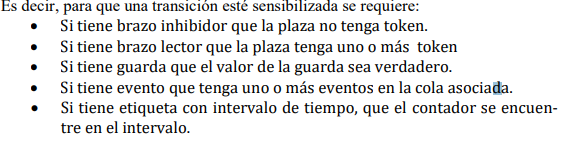

# Para hacer:
- clase hilos
	q tengan serie de transiciones asociadas
- ver tema de sincronización de hilos
- log
- implementar bien main
- en la clase petrinet hay métodos que faltan implementar (tienen comentarios con lo que deberían hacer)

## Main
- crear rdp
- habilitar monitor (con su respectiva política)
- condición de cierre

## Red de petri

- Transiciones habilitadas
- Ecuación de estado
- Disparar transición: actualiza estado de la PN
- Transición completada
- Checkear invariantes: si no se cumplen tirar error
- habilitar transiciones
		

**VERIFICAR SI VECTOR DE DISPARO ES UN 'CHORIZO PARADO'**

## Monitor
Recordar: **notify, wait, ¿alguien en la cola?**
- tomar mutex
- Estadecuación de estado ? nadie en la transición?
Estados: 
		Estado 1:
					- no se cumple la ecuacin de estado
					hay un hilo trabajando en la transición
		Estado 2:
				

## Política
- decisión? 
	(no se me ocurre que haga falta otro método en esta clase)

## Colas
- esperar
- salir
- ¿alguien esperando?

## Hilos
Idea intuitiva: **Hilos tratan de disparar sus transiciones asociadas todo el tiempo. Monitor maneja los disparos.**
-	Asociar transiciones específicas a hilos.
De esta forma tendríamos hilos específicos por partes del código.

###### ver como darles a run despues xdxd

## RdP Temporales
- Idea: esperar tiempo minimo "alpha" desde que se sensibiliza, y no más de "beta" para disparar.
- beta= lo más grande posible para que nunca se desensibilice. (máx cantidad de un long)

## Info auxuliar

Ecuación de estado:  https://www.researchgate.net/publication/328253053_Ecuacion_de_estado_generalizada_para_redes_de_Petri_no_autonomas_y_con_distintos_tipos_de_arcos

**Tiene información sobre RdP temporales**